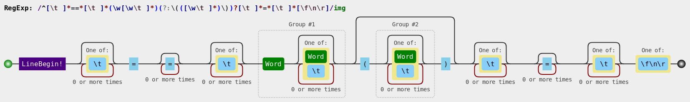
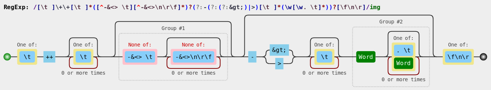
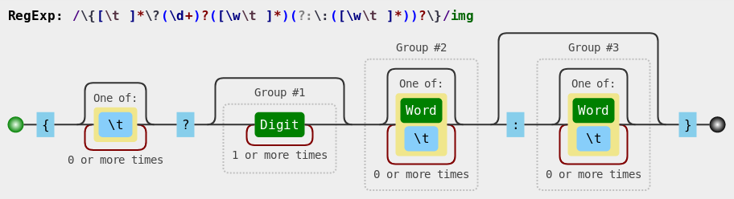
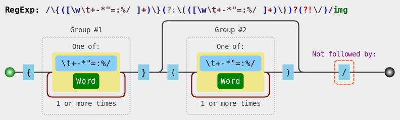
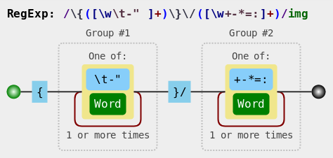

# Translator of Case Notebooks

Translates case notebook narratives (extension of markdown) to object representations and further to HTML. 

Regular expression images generated by [Regulex](https://jex.im/regulex/).

## Knot
### Markdown to Object
* Sentence: `== [title] ([category]) ==`
* Expression: `^[ \t]*==*[ \t]*(\w[\w \t]*)(?:\(([\w \t]*)\))?[ \t]*=*[ \t]*[\f\n\r]`
  * Group #1: title
  * Group #2: category

* Object:
```
{
   type: "knot"
   title: <title of the knot>
   category: <knot category>
   content: [<elements subordinated to this knot>]
}
```

## Text
Markdown text that does not match to any expression.
* Object:
```
{
   type: "text"
   id: 
   content: <unprocessed content in markdown>
}
```

## Option
### Markdown to Object
* Sentence: `++ [label] -> [target]`
* Expression: `[ \t]*\+\+[ \t]*([^-&<> \t][^-&<>\n\r\f]*)?(?:-(?:(?:&gt;)|>)[ \t]*(\w[\w. \t]*))?[\f\n\r]`
  * Group #1: label
  * Group #2: target

* Object:
```
{
   type: "option"
   label: <label to be displayed -- if there is not an explicit target, the label is the target>
   target: <target node to divert>
}
```
### Object to HTML
* Template:
```
<dcc-trigger link='[link].html' label='[display]' [image]></dcc-trigger>
   [image] -> image='[image-file].svg' location='control-panel'
```

## Divert
### Markdown to Object
* Sentence: `-> [target]`
* Expression: `-(?:(?:&gt;)|>) *(\w[\w. ]*)`
  * Group #1: target

* Object:
```
{
   type: "divert"
   target: <target node to divert>
}
```
### Object to HTML
* Template:
```
<dcc-trigger link='[link].html' label='[display]'></dcc-trigger>
```

## Talk
### Markdown to Object
* Sentence: `:[character]: [talk]`
* Expression: `^[ \t]*: *(\w[\w ]*):[ \t]*([^\n\r\f]+)`
  * Group #1: character
  * Group #2: speech

* Object:
```
{
   type: "talk"
   character: <identification of the character>
   speech: <character's speech>
}
```
### Object to HTML
* Template:
```
<dcc-lively-talk character='[character]' speech='[speech]'>
</dcc-lively-talk>
```

## Input
### Markdown to Object
* Sentence: `{?[rows]  [variable]: [vocabulary]}`
* Expression: `\{[ \t]*\?(\d+)?([\w \t]*)(?:\:([\w \t]*))?\}`
  * Group #1: rows
  * Group #2: variable
  * Group #3: vocabulary

* Object:
```
{
   type: "input"
   variable: <variable that will receive the input>
   rows: <number of rows for the input>
   vocabulary: <the vocabulary to interpret the input>
}
```
### Object to HTML
* Template:
```
<[input-type] [input-parameters] class='userInput' id='[variable]'
   oninput="followInput('[variable]','[vocabulary]')">
</[input-type]>
<span id='[variable]_result'></span>
```

## Domain
* Sentence outside: `{[natural]}([formal])`
* Expression outside: `\{([\w \t\+\-\*"=\:%\/]+)\}(?:\(([\w \t\+\-\*"=\:%\/]+)\))?(?!\/)`
  * Group #1: natural
  * Group #2: formal

* Sentence inside: `[expression] =|: [specification] / [rate]`
* Expression inside: `([\w \t\+\-\*"]+)(?:[=\:]([\w \t%]*)(?:\/([\w \t%]*))?)?`
  * Group #1: expression
  * Group #2: specification
  * Group #3: rate

* Object:
```
{
   type: "domain"
   natural: {
      complete: <complete text in natural language>
      expression: <expression in the text to be evaluated>
      specification: <specify the expression defining, for example, a measurable value, rate or origin>
      rate: <compose the rate of the specification>
   }
   formal: {
      complete: <complete text written in formal way to be recognized against a dictionary>
      expression: <expression in the text to be evaluated>
      specification: <specify the expression defining, for example, a measurable value, rate or origin>
      rate: <compose the rate of the specification>
   }
}
```
### Object to HTML
* Template:
```
[natural]
```

## Selector
* Sentence: `{[expression]}/[value]`
* Expression: `\{([\w \t\-"]+)\}\/([\w\+\-\*=\:]+)`
  * Group #1: expression
  * Group #2: value

* Object:
```
{
   type: "selector"
   expression: <expression to be evaluated>
   value: <right evaluation of the expression>
}
```
### Object to HTML
* Template:
```
<dcc-state-selector>[expression]</dcc-state-selector>
```

